# Kids Art Club

---

This project, called Kids Art Club, is about creating a website for a talented artist and fashion design student who teaches art to Uyghur children in Istanbul. She is amazing at what she does and needs more support to share her work and promote her art classes.

The website showcases her, and her students artworks and the Kids Art Club courses. It helps display her students's art, provides information about the courses, and makes it easy for people to sign up. She also need help with social media to reach more people and share her work.

This website was build as part of a full-stack software development program at Code Institute. The task was to create a statick front-end website using only HTML5 and CSS3 to present useful information to users.

[Live project here](https://mustafa-vienna.github.io/pp1-kids-art-club/)
---

## CONTENTS

* [User Experience](#target-experience)
  * [Target Audience](#target-audience)
  * [User Stories](#user-stories)

* [Design](#design)
  * [Color Scheme](#color-scheme)
  * [Reasoning Behind Color Choices](#reasoning-behind-color-choices)
  * [Typography](#typography)
  * [Wireframes](#wireframes)

* [Features](#features)
  * [General Features on Each Page](#features-on-each-page)
  * [Future Implementations](#future-implementations)
  * [Accessibility](#accessibility)

* [Technologies Used](#technologies-used)
  * [Languages Used](#languages-used)
  * [Frameworks & Libraries & Programs used](#frameworks-libraries-programs-user)

* [Deployment & Local Development](#deployment-local-development)
  * [Deployment](#deployment)
  * [Local Development](#local-development)
    * [How to Clone](#how-to-clone)

* [Testing](#testing)
  * [Manual Testing](#manual-testing)
  * [W3C Testing](#html-css-testing)
  * [Lighthouse](#optimization-testing)
  * [Wave](#accessibility-testing)

* [Bugs](#bugs)

* [Credits](#credits)
  * [Code Used](#code-used)
  * [Content](#contents)
  * [Media](#media)
  * [Acknowledgements](#acknowledgements)

  ---
## Target Audience

The Kids Art CLub website is designed to attract and serve the following target audiance:

1. **Parents of Young Artists**: Parents looking for creative activities and art classes for thier children, especilly those who want to encourage their artistic talents.

2. **Young Artists (Children)**: Children intressed in art who want to join a community of like-minded peers, learn new techniques, and showcase their artwork.

3. **Art Enthusiasts and Supporters**: Individuals who appreciate art and want to support young artists, particularly those innteressed in the cultural and artistic contributions of the Uyghur community.

4. **Educational Institutions and Teachers**: Schools and teachers looking for art resources, collibration opportunities, and creative extracurricular activities for thier students.

5. **Potential Sponsors and Donors**: Organization and individuals willing to support the artist'smission through donations, sponsorships, or partnerships.

6. **Social Media Followers**: People who follow art-related content on sosial media platforms and can help promote and share the artist's work and ar classes.

[Go to Contents](#contents)

### User Stories

#### Parents of Young Artists

1. **As a parent**, I want to find art classes for my child, so they can develop their creativity.
2. **As a parent**, I want to see students artwork, so i can judge the quality of the classes.
3. **As a parent**, I want easy access to class schedules and enrollment info, so I can sign up my child quickly.

#### Young Artists (Children)

1. **As a young artist**, I want to join a community of kids who love art, so I can make new friends.
2. **As a young artist**, I wanto to showcase my artwork on the website, so others can see my creations.
3. **As a young artist**, I want to learn new art techniques, so I can improve my skills.

#### Art Enthusiasts and Supporters

1. **As an art enthusiast**, I want to discover young artists, so I can support their growth.
2. **As an art enthusiast**, I want to stay imformed about the club's activities, so I can participate.
3. **As an art enthusiast**, I want to donate or sponsor the club, so I can help provide resources.

#### Educational Institutions and Teachers

1. **As a teacher**, I want to collaborate with the Kids Art Club, so I can offer more art resources to my students.
2. **As a teacher**, I want to use the club's resources in my lessons, so I can enhance my teaching.
3. **As a teacher**, I want to promote the art club to my students, so they can benefit from extra art education.

#### Potential Sponsors and Donors

1. **As a potential sponsor**, I want to know the club's moission and impact, so I can decide to support them.
2. **As a potential sponsor**, I want to know my donation will be used, so I can see its impact.
3. **As a potential sponsor**, I want to be involved in events, so I can see the benefits of my support.

#### Social Media Followers

1. **As a social media follower**, I want regular updates from the Kids Art Club, so I can stay engaged.
2. **As a social media follower**, I want to join online events or challlenges, so I can interact with the community.
3. **As a social media follower**, I want to share the club's work on my profiles, so I can help spread awareness.

[Go to Contents](#contents)

## Design

### Color Scheme

The color scheme for the Kids Art Club website was choosen to create a warm, inviting, and playful atmosphere that appeals to both children and parents. The following colors were used throughout the site to maintain a consistent and engaging look:

 
[Go to Contents](#contents)

### Reasoning Behind Color Choices

 - **Primary Color**:
   - **Dark Red (RGBA(26, 4, 4, 0.8))**: Used for primary element such as header and important highlights to create a strong and bold impression.

- **Secondary Color**:
  - **Purpule (rgba(164, 41, 168, 0.868))**: Used for secondary elements and accents to add vibrancy and creative feel to the design.

- **Accent Colors**:
  - **Thistle (#1036bf)**: Used for the logo to ensure it stands out with a unique and recognizable color.
  - **White Smoke (#f5f5f5e7)**: Used for placeholders and page background to keep the design clean.

- **Neutral Colors**:
  - **Blue Violet (rgba(113, 114, 117, 0.826))**: Used for borders to provide subtle separation between different section.
  - **Ghost White (#e0e1e9)**: Used for buttons to ensure they are easily identifiable and inviting to click.
  - **Light Cyan (#ddfdfe)**: Used for singup form background and hover effet to provide a gentle and interactive user experience.
  - **Granite Gray (#3a3a3a)**: Used for input border to ensure form elements are clearly defined and accessible.

These colors were selected not only for thier aesthetic appeal but also for their ability to create a cohesive and engaging user experience. The combination of warm and cool tones helps to highlight key elements and make the website both attractive and functional.

[Go to Contents](#contents)

### Typography

The Kids Art Club website uses a combination of fonts to create a visually appealing and cohesive design. These fonts were chosen for their readability, versatility, and aesthetic appeal. Below are the details of fonts used:

### Used fonts during this project
- **Fredoka One**: Imported as it is (Since it only has one style).
- **Open Sans**: Imported the weights 300, 400, 600, and 800.
- **Roboto**: Imported regular 400 and bold 600 weights, both in normal and italic styles.

[Go to Contents](#contents)

### Wireframe

#### Home

- Desktop

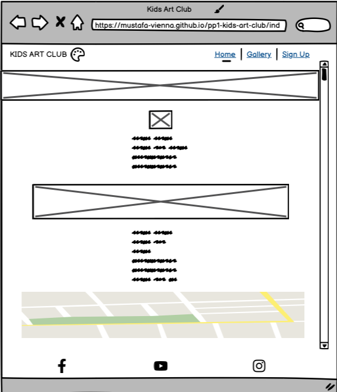 

- Laptop

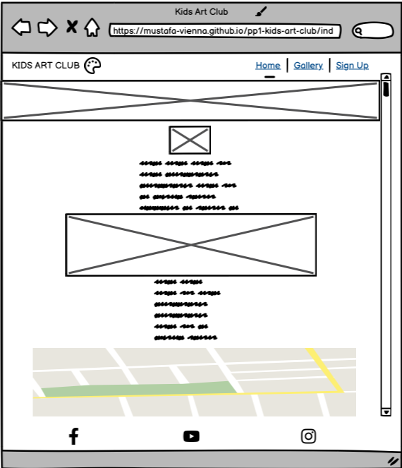 

- Tablet

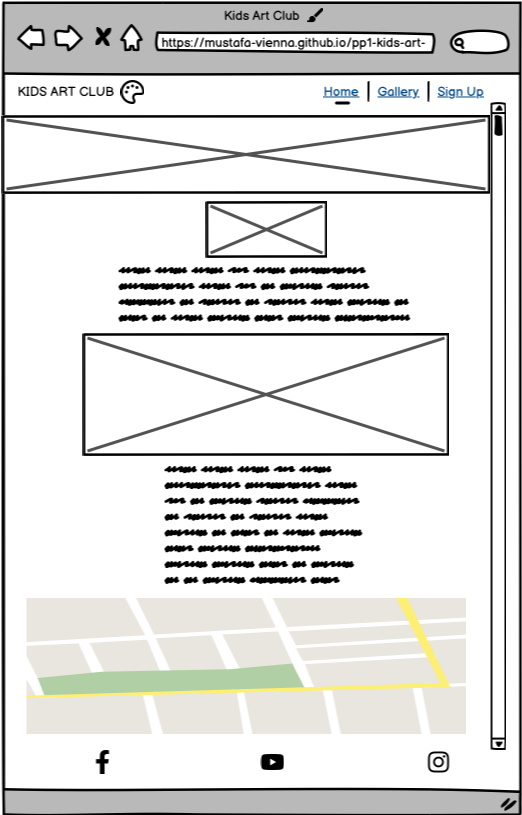 

- Mobile

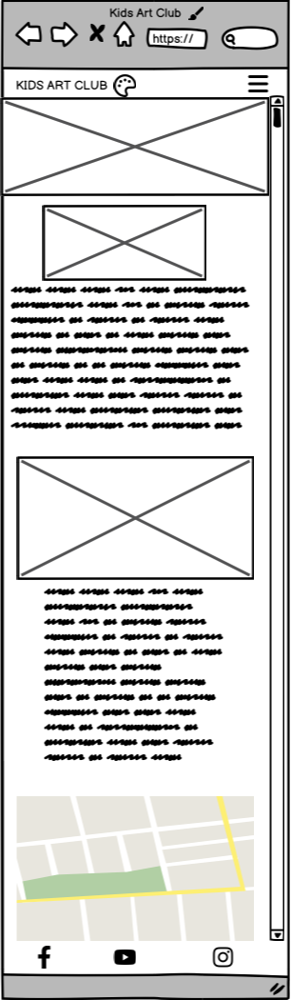

#### Gallery

- Desktop

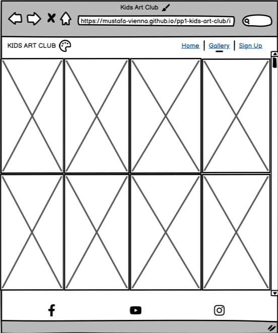 

- Laptop

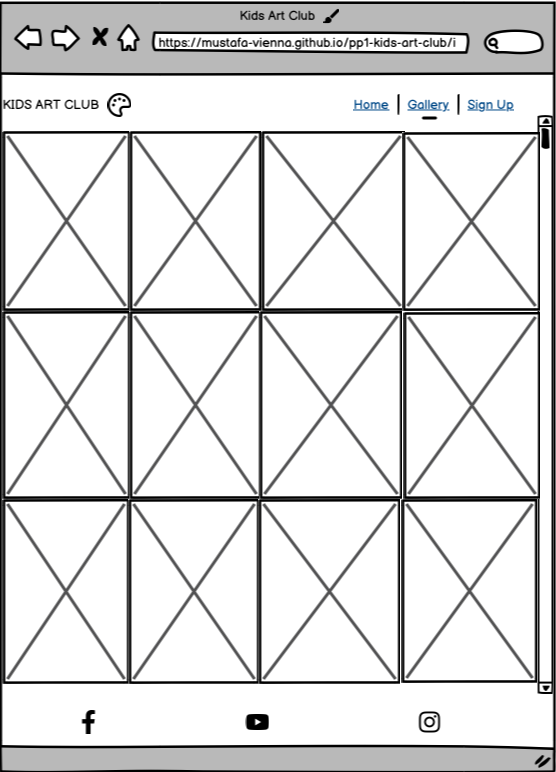 

- Tablet

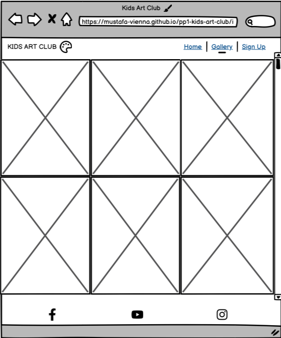 

- Larger screen Mobile (576px - 768px)

-Gallery.png) 

- Mobile

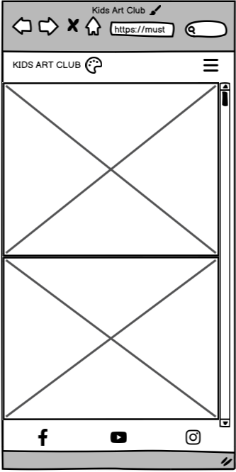

#### Sign Up

- Desktop

 

- Laptop

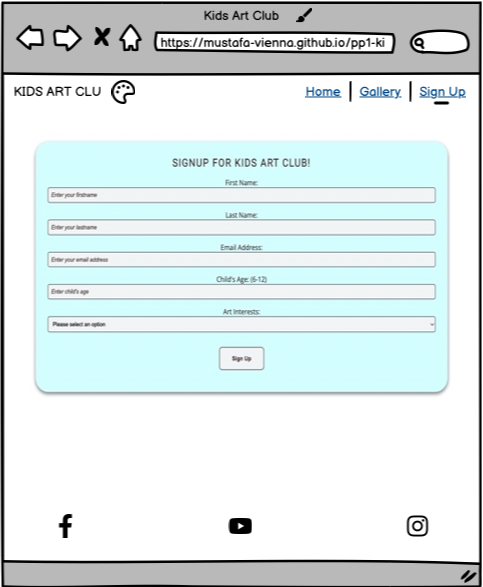 

- Tablet

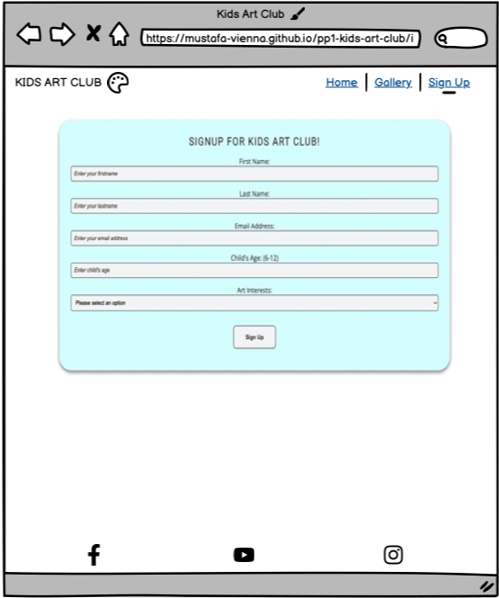 

- Mobile

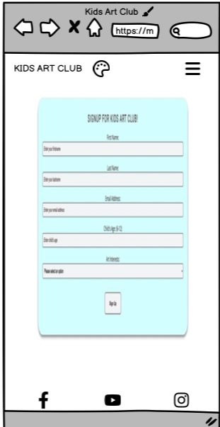