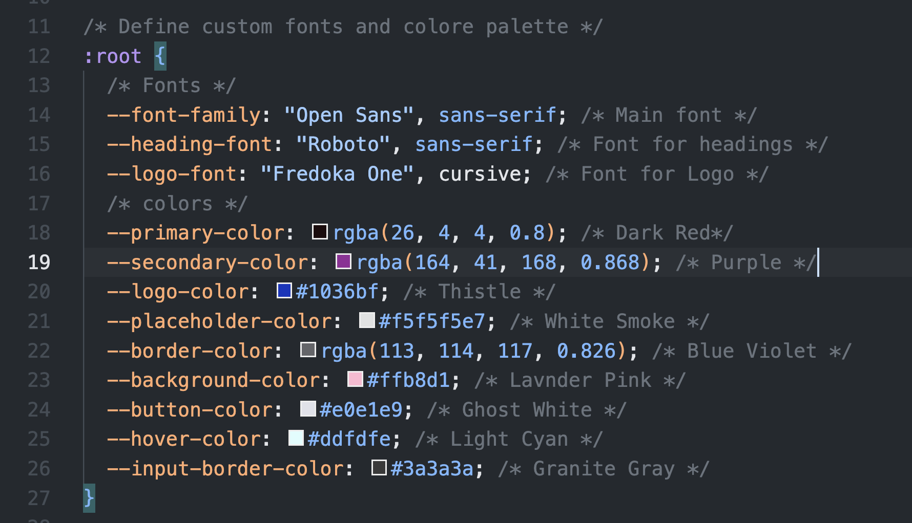
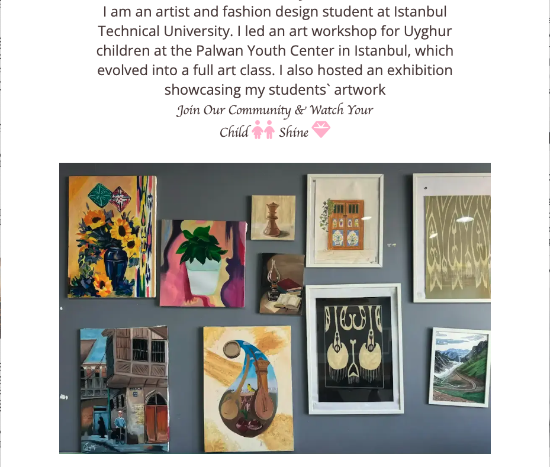
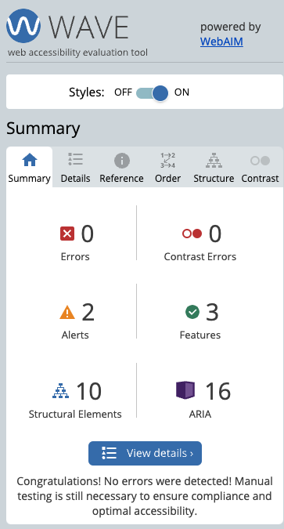

# Kids Art Club

---

This project, called Kids Art Club, is about creating a website for a talented artist and fashion design student who teaches art to Uyghur children in Istanbul. She is amazing at what she does and needs more support to share her work and promote her art classes.

The website showcases her, and her students artworks and the Kids Art Club courses. It helps display her students's art, provides information about the courses, and makes it easy for people to sign up. She also need help with social media to reach more people and share her work.

This website was build as part of a full-stack software development program at Code Institute. The task was to create a statick front-end website using only HTML5 and CSS3 to present useful information to users.


[Live project here](https://mustafa-vienna.github.io/pp1-kids-art-club/)
---

## CONTENTS

* [User Experience](#target-experience)
  * [Target Audience](#target-audience)
  * [User Stories](#user-stories)

* [Design](#design)
  * [Color Scheme](#color-scheme)
  * [Reasoning Behind Color Choices](#reasoning-behind-color-choices)
  * [Typography](#typography)
  * [Wireframes](#wireframes)

* [Features](#features)
  * [General Features on Each Page](#features-on-each-page)
  * [Future Implementations](#future-implementations)
  * [Accessibility](#accessibility)

* [Technologies Used](#technologies-used)
  * [Languages Used](#languages-used)
  * [Frameworks & Libraries & Programs Used](#frameworks-libraries-programs-user)

* [Deployment & Local Development](#deployment-local-development)
  * [Deployment](#deployment)
  * [Local Development](#local-development)
    * [How to Clone](#how-to-clone)

* [Testing](#testing)
  * [Manual Testing](#manual-testing)
  * [W3C Testing](#html-css-testing)
  * [Lighthouse](#optimization-testing)
  * [Wave](#accessibility-testing)

* [Bugs](#bugs)

* [Credits](#credits)
  * [Code Used](#code-used)
  * [Content](#contents)
  * [Media](#media)
  * [Acknowledgements](#acknowledgements)


  ---
## Target Audience

The Kids Art CLub website is designed to attract and serve the following target audiance:

1. **Parents of Young Artists**: Parents looking for creative activities and art classes for thier children, especilly those who want to encourage their artistic talents.

2. **Young Artists (Children)**: Children intressed in art who want to join a community of like-minded peers, learn new techniques, and showcase their artwork.

3. **Art Enthusiasts and Supporters**: Individuals who appreciate art and want to support young artists, particularly those innteressed in the cultural and artistic contributions of the Uyghur community.

4. **Educational Institutions and Teachers**: Schools and teachers looking for art resources, collibration opportunities, and creative extracurricular activities for thier students.

5. **Potential Sponsors and Donors**: Organization and individuals willing to support the artist'smission through donations, sponsorships, or partnerships.

6. **Social Media Followers**: People who follow art-related content on sosial media platforms and can help promote and share the artist's work and ar classes.

[Go to Contents](#contents)

### User Stories

#### Parents of Young Artists

1. **As a parent**, I want to find art classes for my child, so they can develop their creativity.
2. **As a parent**, I want to see students artwork, so i can judge the quality of the classes.
3. **As a parent**, I want easy access to class schedules and enrollment info, so I can sign up my child quickly.

#### Young Artists (Children)

1. **As a young artist**, I want to join a community of kids who love art, so I can make new friends.
2. **As a young artist**, I wanto to showcase my artwork on the website, so others can see my creations.
3. **As a young artist**, I want to learn new art techniques, so I can improve my skills.

#### Art Enthusiasts and Supporters

1. **As an art enthusiast**, I want to discover young artists, so I can support their growth.
2. **As an art enthusiast**, I want to stay imformed about the club's activities, so I can participate.
3. **As an art enthusiast**, I want to donate or sponsor the club, so I can help provide resources.

#### Educational Institutions and Teachers

1. **As a teacher**, I want to collaborate with the Kids Art Club, so I can offer more art resources to my students.
2. **As a teacher**, I want to use the club's resources in my lessons, so I can enhance my teaching.
3. **As a teacher**, I want to promote the art club to my students, so they can benefit from extra art education.

#### Potential Sponsors and Donors

1. **As a potential sponsor**, I want to know the club's moission and impact, so I can decide to support them.
2. **As a potential sponsor**, I want to know my donation will be used, so I can see its impact.
3. **As a potential sponsor**, I want to be involved in events, so I can see the benefits of my support.

#### Social Media Followers

1. **As a social media follower**, I want regular updates from the Kids Art Club, so I can stay engaged.
2. **As a social media follower**, I want to join online events or challlenges, so I can interact with the community.
3. **As a social media follower**, I want to share the club's work on my profiles, so I can help spread awareness.

[Go to Contents](#contents)

## Design

### Color Scheme

The color scheme for the Kids Art Club website was choosen to create a warm, inviting, and playful atmosphere that appeals to both children and parents. The following colors were used throughout the site to maintain a consistent and engaging look:




 
[Go to Contents](#contents)

### Reasoning Behind Color Choices

 - **Primary Color**:
   - **Dark Red (RGBA(26, 4, 4, 0.8))**: Used for primary element such as header and important highlights to create a strong and bold impression.

- **Secondary Color**:
  - **Purpule (rgba(164, 41, 168, 0.868))**: Used for secondary elements and accents to add vibrancy and creative feel to the design.

- **Accent Colors**:
  - **Thistle (#1036bf)**: Used for the logo to ensure it stands out with a unique and recognizable color.
  - **White Smoke (#f5f5f5e7)**: Used for placeholders and page background to keep the design clean.

- **Neutral Colors**:
  - **Blue Violet (rgba(113, 114, 117, 0.826))**: Used for borders to provide subtle separation between different section.
  - **Ghost White (#e0e1e9)**: Used for buttons to ensure they are easily identifiable and inviting to click.
  - **Light Cyan (#ddfdfe)**: Used for singup form background and hover effet to provide a gentle and interactive user experience.
  - **Granite Gray (#3a3a3a)**: Used for input border to ensure form elements are clearly defined and accessible.

These colors were selected not only for thier aesthetic appeal but also for their ability to create a cohesive and engaging user experience. The combination of warm and cool tones helps to highlight key elements and make the website both attractive and functional.

[Go to Contents](#contents)

### Typography

The Kids Art Club website uses a combination of fonts to create a visually appealing and cohesive design. These fonts were chosen for their readability, versatility, and aesthetic appeal. Below are the details of fonts used:


### Used fonts during this project
- **Fredoka One**: Imported as it is (Since it only has one style).
- **Open Sans**: Imported the weights 300, 400, 600, and 800.
- **Roboto**: Imported regular 400 and bold 600 weights, both in normal and italic styles.

[Go to Contents](#contents)

### Wireframes

#### Home

- Desktop

<br>

- Laptop

<br>

- Tablet

<br>

- Mobile


#### Gallery

- Desktop

<br>

- Laptop

<br>

- Tablet

<br>

- Larger screen Mobile (576px - 768px)

-gallery.png)<br>

- Mobile


#### Sign Up

- Desktop

<br>

- Laptop

<br>

- Tablet

<br>

- Mobile


[Go to Contents](#contents)

## Features

### General features on each page

The header and footer are consistently displayed accross all three pages-Home, Gallery, and Signup-ensuring a unified and seamless user experience. On mobile devices, the navigation bar transforms into a hamburger menu, providing an intuitive and space-efficient way to navigate the site. This responsive design ensures that the website adapts beautifully to various screen sizes and devices, maintaining usability and aesthetics whether accessed on desktop, laptop, tablet, or smartphone. The consistent header and footer across all pages enhance navigation and brand identity, while the responsive design ensures accessibility and a positive user experience for all visitors.

### Navbar

#### Desktop, Laptop, and Tablets

The navbar is at the top. It shows link to Home, Gallery, and Signup. Links are clear and easy to click.


#### Mobile

The navbar becomes a hamburger menu. Tap the icon to see links. It saves space and looks neat.


### Footer

The footer contains social media icons for easy access. Users can find icons linking to Facebook, Instagram, and Youtube. These icons are clearly displayed and provide quick links to our social media pages, ensuring users can connect with up on multiple platforms.


## Page-Specific Features

### Landing/Home page

The Landing/Home page includes:

- **Hero Image**: A large, attractive image below the header with a background of Uyghur traditional clothes. And the talented artist Zuleyha Abdul's profile picture.


- **About Zuleyha**: Introduction of Zuleyha Abdul, the art teacher.
- **Students' Artwork**: An image showcasing various painting by students.



- **Contact Information**: Details for joining the Kids Art Club, including address, phone, email, and opning hours.

- **Map**: An embedded map to locate the club easily.


### Gallery page

The Gallery page features 15 pictures showcasing both pencil sketches and oil paintings. These artworks include creations by both the teacher and students, highlighting the diverse talents within the Kids Art Club.


### Signup page

The Signup page includes a contact form for enrolling in  the kids Art Club. The form collects the following information.

- **First Name**: Text input, required, only letters, max length 12.
- **Last Name**: Text input, required, only letters, max length 12.
- **Email Address**: Text input, required, valid email format.
- **Child's Age**: Number input, required, between 6 and 12.
- **Art Interests**: Dropdown menu with options for Painting.


[Go to Contents](#contents)

## Future Implementations

I plan to improve the Kids Art Club website with interactive features using JavaScript. This will include online art classes and more dynamic gallery. As I learn more, I will make the site more engaging and user-firendly.

## Accessibility

The Kids Art Club website is designed with accessibility in mind to ensure all users can navigate and enjoy the content. Key accessibility features include: 

- **Responsive Design**: The site is fully responsive, adapting to different screen sizes and devices to provide a seamless experience for all users.

- **Alt Text for Images**: All images on the site inckude descriptive alt text to aid users with screen readers.

- **Keyboard Navigation**: The site supports full keyboard navigation to assit users who cannot use a mouse.

- **Contrast and Readability**: High contrast colors and readable fonts are used throughout the site to ensure text is easy to read.

- **Semantic HTML**: The sites uses semantic HTML elements to improve accessibiity and SEO.

Those features help make the Kids Art Club website inclusive and user-friendly for everyone.

## Technologies used

In the Kids Art Club website, the following technologies and tools were used:

- **GitHub**: For version control and project management.
- **Visual Studio Code**: As the primary code editor for development.
- **HTML5**: To structure the content of the website. 
- **CSS3**: For styling and layout of the website.
- **Google Font**: To enhance typography and design.
- **Google Map**: For embadding a map to show the club's location.
- **Google Developer Tools (Lighthouse)**: For performance, accessibility, best-practices, and SEO analysis.
- **FontAwesome**: For including various icons.
- **Favicon**: Too add a custom icon to the website.
- **Balsamiq**: For creating wireframes and planning the website layout.
- **Color.co**: For selecting and managing color schemes.
- **WebAIM.org**: For ensuring web accessibility standards.
- **Fotor.com**: For editing and optimizing images.
- **TinyPNG**: For compressing images to improve load times.
- **ui.dev/amiresponsive**: For testing the website's responsiveness on different devices.
- **Wave**: Forweb accessibility evaluation.
- **Developer.mozilla.org**: As a reference for web development standards and practices.
- **W3Schools.com**: For additional tutorials and resources.
- **Validator.w3.org**: For validating HTML code.
- **Jigsaw.w3.org**: For validating CSS code.

Those tools and resources helped in creating user-friendly Kids Art Club website.

[Go to Contents](#contents)

## Languages Used

**HTML**<br>
**CSS**


## Frameworks & Libraries & Programs Used

- **GitHub**: Utilized for version control and as a backup for the project components.

- **VSCode**: Extensively used for coding and development tasks.

[Go to Contents](#contents)

## Deployment & Local Development

### Deployment

To deploy this project, follow these steps:

1. **Create a New Repo**: Open GitHub and create a new repo using [CI Full Template](https://github.com/code-institute-org/gitpod-full-template) provided by Code Institute. Name the repo `pp1-kids-art-club`

2. **Create a New Workspace**: Click the Gitpod button to create a new workspace based on the new repo.

### Local Development

To set up the project for local development, follow these steps:

#### How to Clone

1. **Log into Your Github Account**: Ensure you are logged into your Github account.
2. **Go to the Repo**: Navigate to the repo for this project.
3. **Copy the Clone Link**: Click on the "Code" button and copy your perferred clone link (HTTPS, SSH, or GitHub CLI).
4. **Open the Terminal**: Open the terminal in your code editor.
5. **Change Directory**: Change current working directory to the location where you want the coloned directory to be created.
6. **Clone the Repo**: Type `git clone` in the terminal, paste the link you copied in the step 3, and press Enter.

[Go to Contents](#contents)

#### Used Git Commands

```bash 
git add.
git status
git commit -m "Your commit masssage"
git push
```

## Testing

### Manual Testing

Manual testing was conducted to ensure that common elements functioned correctly and were responsive on different devices. The following checks were confirmed.

1. **Navbar Links**: Verified that clicking on Navbar links navigates to the correct page. (Home, Gallery, and Signup)
2. **Logo**: Ensure that clicking on the Logo redirects to the Home page.
3. **Page Responsiveness**: Checked the responsiveness of the all pages (Home, Gallery, and Signup) across devicess.
4. **Button**: Confirmed that buttons on the Home page and other pages navigate to the appropriate section or the pages.
5. **Map Interaction**: Tested that clicking the "View" link on the map screen opens the correct location.
6. **Social Media Links**: Verified that clicking on Social Media icons redirects to the appropriate Social Media pages.
7. **Form Validation**: Tested the form to ensure all fields must be filled out to submit.

Following Devices were used for testing:

#### Browser

* Google Chrome
* safari

#### Laptop

* Macbook Air M1, 13-inch
* Samsung Monitor 32-inch
* Asus Zenbook Fold

#### Tablets

* Blackberry Playbook
* Nexus 10
* iPad Mini
* iPad Air
* iPad Pro
* Surface Pro 7

#### Mobile devices

* Google Pixel 6
* Galaxy Note 3
* Nexus 6P
* Nokia N9
* iPhone SE
* iPhone XR
* iPhone 12 Pro
* iPhone 14 Pro max
* iPhone 15 Pro max
* Pixel 7
* Samsung Galaxy Z Fold 4
* Samsung Galaxy S8+
* Samsung Galaxy S20
* Samsung Galaxy S20 Ultra
* Samsung Galaxy A51/71
* Surface Duo

[Go to Contents](#contents)

### W3C Testing

#### Jigsaw CSS Validator

The CSS code was validated using [Jigsaw W3 Validator](https://jigsaw.w3.org/css-validator/)


- **Pass**

#### W3 HTML Validator

The HTML code was validated using [W3C Validator](https://validator.w3.org/#validate_by_uri+with_options)


- **Pass**


- **Pass**


- **Pass**

[Go to Contents](#contents)

## Lighthouse

I use Lighthouse to test and improve my website's performance, accessibility, best practice, and SEO.

### Landing/Home page


### Gallery page


### Signup page


[Go to Contents](#contents)

## Wave

### Accessibility Testing

I use the Wave extension to test and imorove website accessibility. It provides detailed insights and recommendations, making it easier to identify and fix accessibility issues, ensuring an inclusive user experience for all. 

#### Home page



#### Gallery page


#### Signup page


[Go to Contents](#contents)

## Bugs

I used a Google Maps embedded map on the website. After running Lighthouse, I encountered issue related to third-party cookies and console errors, which I couldn't resolve.

### Issues Identified

1. **Third-Party Cookies**: The embedded Google Maps uses third-party cookies, which affects the best practices score.

2. **Console Errors**: Unchecked runtime errors related to essage ports were logged in the console.


[Go to Contents](#contents)

## Credits

### Code Used

- **Navigation Bar & Gallery page structures**: Code used from Love running Project Challenge.
- **Signup Form with Validation**: Code modified from [Stackoverflow](https://stackoverflow.com/questions/76068289/how-do-i-only-allow-the-user-to-type-alpha-characters-in-html-text-input)
- **Other Code**: Borrowed and modified from students project, w3schools, stackoverflow.

#### Assistance

- **ChatGPT**: Used for understanding CSS code, troubleshooting, and improving my English writing skills, particularly for crafting the README file.

#### Youtube channels

- [Dave Gray](https://www.youtube.com/@DaveGrayTeachesCode)
- [Bro Code](https://www.youtube.com/@BroCodez)

### Content

The inspiration for this website came from the artist Zulayha, who I encountered during my recent vacation in Istanbul. Impressed by her artwork, ambition, and dedication to teaching children through art, I decided to assist her in creating her first ever website. THis project aims to showcase her creative journey and provide platform to share her passion for art with a wider audience. The content reflects her and her students unique artistic vision, incorprating elements of her style while ensuring an engaging and user-friendly experience.

### Media

All the pictures on the Kids Art Club website were provided by the teacher and artist, Zulayha. These images showcase the creativity and artistic expression fostered in her class.

### Acknowledgememts

I want to thank my mentor, Luke. Without his help, I would have struggled with this first project. His clear guidance and feedback always kept me on track.

A big thank you to my classmate/friend Ioan, a senior developer. He game me detailed advice, helped me manage my time, and tested my project.

Thanks also to Lorenz for his quick help and support.

[Go to Contents](#contents)